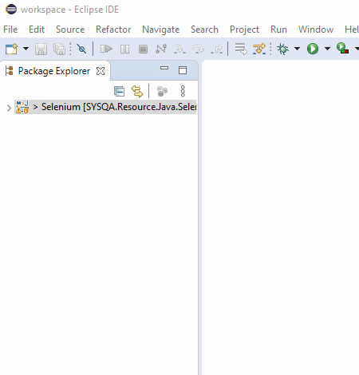
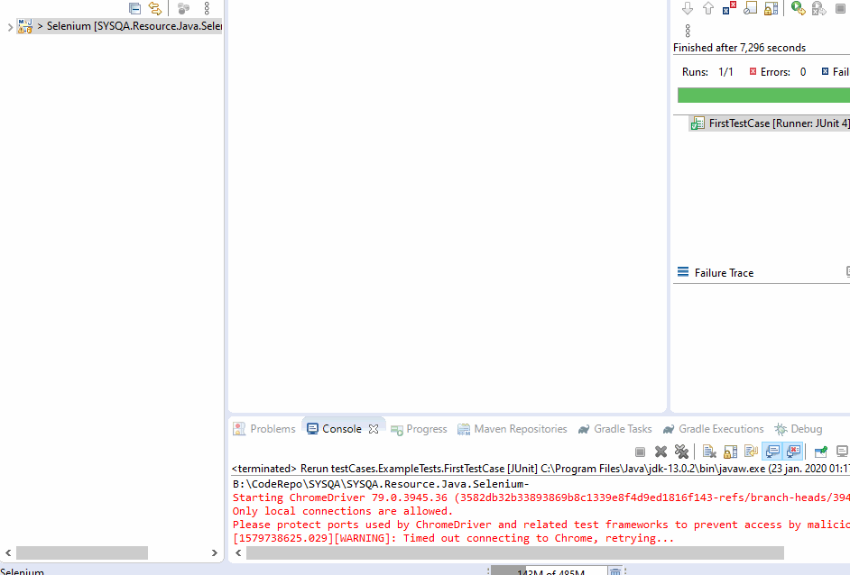

# SYSQA.Resource.Java.Selenium

## Doel

Met deze resource proberen we twee hoofd doelen te berijken:

1. Het bieden van een begin project om de opstart fase van een nieuw test script te versnellen
1. Het beschijven en uitleggen van één implementatie van het `Page-Object Model` om zo bij te dragen aan een overzichtelijk en onderhoudbaar Selenium Java project.

Om deze doelen te berijken proberen we voor dit project een aantal uitgangspunten te hanteren:

1. We blijven dicht bij de originele taal.
1. We houden het bij de basis functionaliteiten 
1. We zetten het zo op dat we eenvoudig kunnen uitbreiden en aanvullen
1. We houden de setup en ontwikkel omgeving zo eenvoudig mogelijk

Je zult hopelijk snel merken dat je dingen wil doen die niet aan dit project zijn toegevoegd. Wij hopen je genoeg kennis mee te hebben gegeven van de basis om deze dingen zelf (of met onze hulp) aan je framework toe te kunnen voegen.

Dit doen we door de keuzes die we gemaakt hebben in dit project door middel van comment en dit begeleidende document uit te leggen en mocht je meer willen weten (of aanvullingen hebben) zoek dan voorall contact met ons.

## Belangrijk om te weten

Gedurende iedere stap in een project worden er keuzes gemaakt. Voor sommige dingen is het belangrijk om vooraf te weten waarom bepaalde keuzes zijn gemaakt.

Dit is een kort overzicht van de redenatie achter een aantal belangrijke keuzes.

## Voorbereiding
De volgende stappen moet je nemen voor dat je aan dit project kunt beginnen.
* Intalleer de benodigde software
    * [Download en installeer Eclipse IDE](https://www.eclipse.org/downloads/)
    * [Download en installeer de aanbevolen versie van Java Software Development Kit](https://www.oracle.com/technetwork/java/javase/downloads/jdk11-downloads-5066655.html)
* Clone de gitrepository of [download de zip hier](https://github.com/SYSQA-ExpertiseLeadership/SYSQA.Resource.Java.Selenium-/archive/master.zip)
* [Download de Chrome Diver](https://chromedriver.chromium.org/) (Met het zelfde versie nummer als jou chome browser)
    * [Hier vind je jou chrome versie](chrome://settings/help)
    * plaats de driver in de `src/test/resources` folder van het project
* Start Eclipse druk op `open project from file system` en selecteer de map waar je het project heb uitgepakt 

* Run de tests om te kijken of alle stappen correct zijn doorlopen;

## Tips

## Bijdragen aan deze resource

### tools 
* [screen to gif](https://chocolatey.org/packages/screentogif)